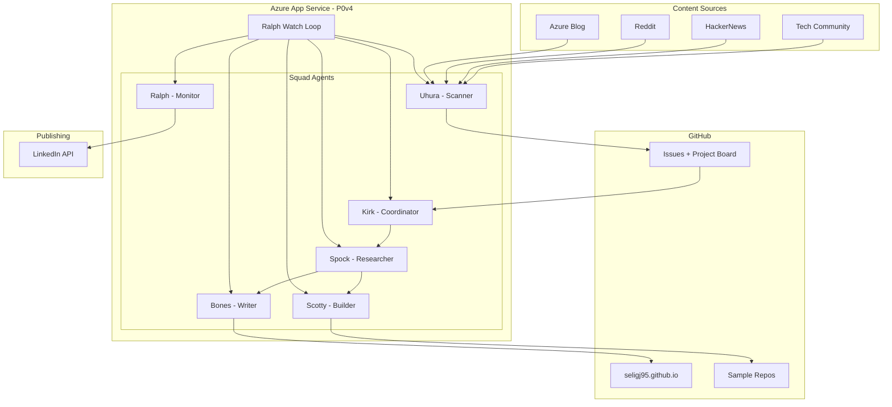

## Why I Built This

I'm a PM on the Azure App Service team. A big part of my job is writing blog posts, building sample repos, and sharing what's new with App Service. I love doing it, but the process is manual — I see something interesting, research it, write the blog, build the sample, create the PR, post to LinkedIn. Every. Single. Time.

I was tasked with building an agent to help automate part of my job. As an individual contributor on my team, I wanted to increase my productivity and influence. I'd already built [OpenClaw](https://github.com/seligj95/openclaw-azure-appservice) — a personal AI assistant. But I needed something bigger: not just a chatbot, but a team.

With Blog Squad, I basically have a team reporting to me. Six AI agents handle the research, writing, and sample creation while I focus on the strategic decisions — what topics matter, what angle to take, and whether the output is good enough to publish.

And yes — this blog post was itself produced by the system. Meta, I know.

## What is Squad?

[Squad](https://github.com/bradygaster/squad) is a multi-agent orchestration framework built on top of the [GitHub Copilot SDK](https://github.com/github/copilot-sdk), created by [Brady Gaster](https://github.com/bradygaster). It gives you named persistent agents with defined roles, routing rules, shared decisions, and a continuous watch loop. Think of it as a way to run multiple Copilot-powered agents that coordinate with each other through GitHub Issues.

[Tamir Dresher wrote an excellent post](https://www.tamirdresher.com/blog/2026/03/10/organized-by-ai) about using Squad to organize his personal productivity — daily news scanning, task management, Teams integration. His implementation was a direct inspiration for Blog Squad. I took the same pattern and applied it to content creation.

## The Architecture

Blog Squad has six agents, each with a defined role:



| Agent | Role | What They Do |
|-------|------|-------------|
| **Kirk** | Coordinator | Triages topics, routes work, sends daily digests |
| **Uhura** | Scanner | Scans HackerNews, Reddit, Tech Community, dev.to for content ideas |
| **Spock** | Researcher | Deep-dives approved topics, checks feasibility, drafts outlines |
| **Scotty** | Builder | Creates sample repos with azd templates, Bicep infra, Dockerfiles |
| **Bones** | Writer | Writes blog posts, generates banner images, drafts LinkedIn blurbs |
| **Ralph** | Monitor | Runs the continuous loop, posts to LinkedIn, sends notifications |

## The Pipeline

The workflow is issue-driven with human-in-the-loop approval at key points:

1. **Discover** — Uhura scans content sources daily at 7 AM PT. Scores relevance (must be 6/10+ to create an issue). Creates GitHub Issues labeled `topic-idea`.
2. **Approve** — I review ideas on my phone (GitHub mobile app), add the `approved` label to topics worth pursuing. I can also create my own ideas with the `my-idea` label.
3. **Research** — Spock deep-dives the topic: what exists, what's novel, what's the App Service angle. Posts a structured research comment with an outline and cost estimate.
4. **Build + Write** — Scotty builds a sample repo while Bones writes the blog post (in parallel). Bones also generates an AI banner image using DALL-E 3 via GitHub Models API.
5. **Review** — I review the PRs. Blog post goes to my personal blog or Tech Community (I decide per topic — no duplicate content).
6. **Publish** — On merge, Ralph posts to LinkedIn automatically.

## The Headless Worker Pattern on App Service

This is where it gets interesting from an App Service perspective. Blog Squad doesn't serve any HTTP traffic. There's no web UI, no API, no endpoints. It's a **headless background worker** running a continuous polling loop.

App Service isn't traditionally associated with this pattern — most people think of it as a web hosting platform. But it works perfectly:

- **Always On** keeps the `ralph-watch.sh` loop alive as PID 1 in the container
- **Custom container** (Docker) with Node.js 20, Squad CLI, GitHub CLI, and Copilot CLI
- **No public endpoints** — `publicNetworkAccess: Disabled`, no inbound traffic needed at all
- **P0v4 plan** — ARM64, 1 vCPU, 3.5 GB RAM, more than enough for agent workloads
- App Service **auto-restarts** the container if it crashes — built-in resilience

The loop is simple: every 5 minutes, Ralph pulls the latest code from git, checks for new issues, routes work to agents, and pushes any changes back. If it's the first round after 7 AM, it triggers Uhura's daily content scan.

## Security: Zero Public Exposure

Every resource in the stack has public access disabled:

| Resource | Protection |
|----------|-----------|
| App Service | `publicNetworkAccess: Disabled` — no inbound traffic |
| ACR (Premium) | Private endpoint, no public access |
| Key Vault | Private endpoint, bypass AzureServices |
| Storage (Azure Files) | Private endpoint, bypass AzureServices |

The App Service connects to ACR, Key Vault, and Storage through **VNet integration** — all traffic stays on the private network via private endpoints. The VNet has two subnets: one for App Service delegation, one for private endpoints. Three private DNS zones resolve the private endpoint addresses.

Secrets (GitHub token, LinkedIn token, Teams webhook URL) are stored in **Key Vault** and referenced via managed identity — no passwords in code or config.

## Publishing: Personal Blog vs. Tech Community

Not everything goes to the same place. I decide per topic:

| Content Type | Destination |
|-------------|------------|
| New App Service feature | Tech Community (Apps on Azure blog) |
| App Service sample/walkthrough | Tech Community |
| General dev blog, personal project | Personal blog |
| Meta/tooling post (like this one) | Personal blog |

If it goes to **Tech Community**, Bones writes simple HTML (no fancy formatting — TC's editor handles that). I paste it manually. Then Bones creates a short link post on my personal blog pointing to the TC URL — no duplicate content.

If it goes to my **personal blog**, Bones writes a full Astro markdown post with frontmatter, architecture diagram, cost estimate, and cleanup instructions. The PR goes to `seligj95/seligj95.github.io`. On merge, GitHub Pages deploys automatically.

Either way, Ralph posts a LinkedIn blurb after publishing.

## AI-Generated Banner Images

Every blog post gets a hero banner generated by **DALL-E 3 via the GitHub Models API** — free with my Enterprise license. The prompt template ensures consistent style: flat design, Azure blue (#0078D4) accents, no text in the image. The banner is committed alongside the blog post in the same PR.

## Cost

| Resource | SKU | Monthly Cost |
|----------|-----|-------------|
| App Service Plan | P0v4 | ~$58/mo |
| Container Registry | Premium (for private endpoints) | ~$50/mo |
| Key Vault | Standard | ~$0.10/mo |
| Storage Account | Standard LRS, 5GB | ~$0.30/mo |
| **Total** | | **~$108/mo** |

If you don't need private endpoints, you can use ACR Basic (~$5/mo) and skip the VNet/PE setup, bringing the total down to ~$63/mo.

## This Post Was Written by the System

I want to be transparent: this blog post was produced by Blog Squad's pipeline. I created [an issue](https://github.com/seligj95/blog-squad/issues/1) with the `my-idea` label. Spock researched the topic and posted an outline. I gave feedback (tweaks to the structure, emphasis on the headless pattern). Bones wrote this post, generated the banner image, and created the PR. I reviewed it, made edits, and merged.

Is it perfect out of the box? No — I still review and refine. But it took the 80% grunt work off my plate and let me focus on the 20% that matters: the ideas and the voice.

## What's Next

- **Teams integration** — Kirk will send daily digests and Ralph will process my replies via WorkIQ MCP
- **End-to-end automation** — Get Squad CLI running properly inside the App Service container
- **More scan sources** — LinkedIn scanning (requires Playwright MCP), Azure App Service GitHub repos for new feature detection
- **Mobile chat** — Real-time conversation with agents from my phone (Discord bot or Copilot SDK web chat — both could be their own blog posts)

## Get Started

The entire system is open source:

```bash
git clone https://github.com/seligj95/blog-squad.git
cd blog-squad
azd up
```

Check out the [repo](https://github.com/seligj95/blog-squad) for the full Squad config, agent charters, Bicep infrastructure, and skill definitions.

## Resources

- [Blog Squad repo](https://github.com/seligj95/blog-squad) — the sample IS this system
- [Squad framework](https://github.com/bradygaster/squad) by Brady Gaster
- [Tamir Dresher's "Organized by AI"](https://www.tamirdresher.com/blog/2026/03/10/organized-by-ai) — the inspiration
- [GitHub Copilot SDK](https://github.com/github/copilot-sdk)
- [Azure App Service documentation](https://learn.microsoft.com/azure/app-service/)
