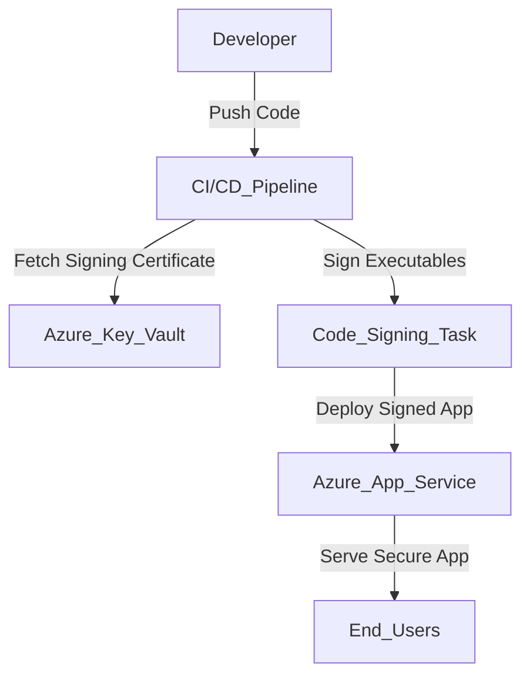

```yaml
---
title: "Secure Your Windows Apps with Azure: Code Signing Best Practices"
description: "Learn how to implement secure code signing for Windows applications deployed via Azure App Service. Protect your apps from supply chain vulnerabilities with these step-by-step instructions."
pubDate: "2026-03-22"
heroImage: "/images/blog/secure-windows-apps-azure-hero.png"
tags: ["Azure App Service", "Azure Key Vault", "Code Signing", "Windows Apps", "CI/CD"]
category: "Tutorial"
author: "Jordan Selig"
---
```

# Secure Your Windows Apps with Azure: Code Signing Best Practices

In a world where software supply chain attacks are on the rise, securing your Windows applications isn’t just a nice-to-have—it’s mandatory. I’ve been there: deploying apps and crossing my fingers that nothing gets intercepted or tampered with in the process. But fingers-crossed isn’t a strategy, and that’s where code signing comes in.

In this post, I’ll walk you through the best practices for securely signing your Windows applications before deploying them via Azure App Service. If you’ve ever wondered how to protect your executables from tampering and ensure they’re trusted by your users, you’re in the right place.

---

## Why Code Signing Matters

Code signing is all about trust. It uses digital certificates to add a cryptographic signature to your app’s executable files, proving that they’re authentic and haven’t been altered. Without code signing, your app is vulnerable to threats like:

- **Tampering**: Attackers could modify your app’s code to include malicious behavior.  
- **Impersonation**: Unsigned apps make it easier for attackers to pass off malware as legitimate software.  

When you combine code signing with Azure’s ecosystem—Azure Key Vault for secure certificate storage and Azure DevOps for automation—you get an end-to-end solution that’s reliable and secure.

---

## Architecture Overview

Here’s a bird’s-eye view of what we’re building:



### Key Components:
1. **Azure Key Vault**: Stores your signing certificates securely.  
2. **CI/CD Pipeline**: Automates the signing process using Azure DevOps or GitHub Actions.  
3. **Code Signing Task**: A step in the pipeline that signs your app’s executables.  
4. **Azure App Service**: Hosts your signed app for users.  

Let’s dive into the implementation!

---

## Prerequisites

Before you start, make sure you have the following:

- An **Azure subscription** (free tier eligible for most services).  
- **Azure CLI** installed on your local machine.  
- A code repository (e.g., GitHub or Azure DevOps).  
- Basic familiarity with CI/CD pipelines.  
- A Windows development environment (like Visual Studio).  
- A code signing certificate (you can generate one using Azure Key Vault).

---

## Step-by-Step Implementation

### ## Step 1: Set Up Azure Key Vault

First, let’s create an Azure Key Vault to store your signing certificate securely.

```bash
# Create a resource group
az group create --name MyResourceGroup --location eastus

# Create a Key Vault
az keyvault create --name MyKeyVault --resource-group MyResourceGroup --location eastus

# Add a code signing certificate
az keyvault certificate create --vault-name MyKeyVault --name MyCodeSigningCert --policy "$(az keyvault certificate get-default-policy)"
```

This will create a Key Vault and generate a certificate for signing your app. You can verify the certificate with:

```bash
az keyvault certificate show --vault-name MyKeyVault --name MyCodeSigningCert
```

### ## Step 2: Configure Your CI/CD Pipeline

Next, integrate your Key Vault into a CI/CD pipeline. I’ll use Azure DevOps for this example, but GitHub Actions works similarly.

1. **Create a Service Principal**:  
   Grant your pipeline access to Key Vault:

   ```bash
   az ad sp create-for-rbac --name MyPipelineSP --role Contributor --scopes /subscriptions/<your_subscription_id>/resourceGroups/MyResourceGroup
   ```

2. **Add Key Vault Secrets to Pipeline**:  
   In your Azure DevOps pipeline, set up a task to fetch the certificate:

   ```yaml
   steps:
     - task: AzureKeyVault@2
       inputs:
         azureSubscription: 'MyServicePrincipal'
         KeyVaultName: 'MyKeyVault'
         SecretsFilter: '*'
   ```

### ## Step 3: Sign Your Executables

Now, add a code signing step in your pipeline. Here’s an example using a PowerShell task:

```yaml
steps:
  - powershell: |
      $cert = Get-AzureKeyVaultCertificate -VaultName "MyKeyVault" -Name "MyCodeSigningCert"
      $timestamp = Get-Date -Format "yyyyMMddHHmmss"
      $signedFile = "myapp-$timestamp-signed.exe"
      
      # Sign the executable
      signtool sign /tr http://timestamp.digicert.com /td sha256 /fd sha256 /a /f $cert.Path /p $cert.Password myapp.exe /out $signedFile
    displayName: "Sign Windows Executables"
```

### ## Step 4: Deploy to Azure App Service

Finally, deploy your signed app to Azure App Service:

```bash
# Create an App Service plan
az appservice plan create --name MyAppServicePlan --resource-group MyResourceGroup --sku B1 --is-linux false

# Deploy the app
az webapp create --name MySignedApp --resource-group MyResourceGroup --plan MyAppServicePlan --runtime "DOTNET|6.0"

# Push your signed executables
az webapp deploy --resource-group MyResourceGroup --name MySignedApp --src-path ./signed-app/
```

---

## Cost Estimate

Here’s the breakdown:

- **Azure Key Vault**: Free tier includes standard storage; advanced tiers cost ~$5-$10/month.  
- **Azure App Service**: Free tier available; paid plans start at $13/month.  
- **CI/CD Pipeline**: Free for up to 1,800 minutes/month on Azure DevOps.  

Most of this setup is free-tier eligible, but plan for ~$20/month if you need advanced features.

---

## Cleanup Instructions

When you’re done, clean up resources to avoid unwanted charges:

```bash
# Delete the resource group
az group delete --name MyResourceGroup --yes --no-wait
```

Also, don’t forget to rotate your signing certificates periodically for added security.

---

## Conclusion

And that’s it—you’ve successfully implemented secure code signing for your Windows applications deployed through Azure App Service. Not only does this protect your app from tampering, but it also boosts user confidence by proving your app is trustworthy.

If you’re ready to take this further, check out [Microsoft’s documentation on Azure Key Vault](https://learn.microsoft.com/en-us/azure/key-vault/) or explore advanced CI/CD features with [GitHub Actions](https://github.com/features/actions).

Let me know how it goes—drop a comment or share your setup on GitHub. Happy coding! 🚀
```