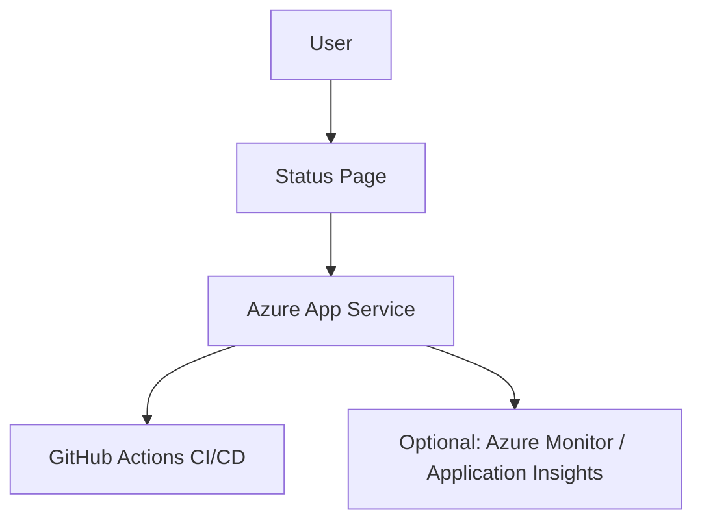

```markdown
---
title: "Build a Status Page with Azure App Service in Under an Hour"
description: "Learn how to create and deploy a simple status page using Azure App Service, complete with CI/CD and optional monitoring tools."
pubDate: "2026-03-25"
heroImage: "/images/blog/status-page-azure-hero.png"
tags: ["Azure App Service", "CI/CD", "Web Development", "Azure Monitor", "Tutorial"]
category: "Tutorial"
author: "Jordan Selig"
---

We’ve all been there. A service goes down, users start pinging support, and you scramble to figure out what’s happening. Enter the humble status page—a simple web app that keeps your users informed about uptime, downtime, and maintenance. It’s a small thing that goes a long way in building trust.

In this tutorial, I’ll walk you through building and deploying a status page using Azure App Service. We’ll cover everything from setting up a basic web app to automating deployments with CI/CD. By the end, you’ll have a production-ready app and the know-how to add bells and whistles like monitoring and analytics.

---

## Architecture Overview

Before we dive into the code, let’s take a look at the architecture:



Here’s how it works:
- Users access the status page hosted on Azure App Service.
- GitHub Actions automates deployments, so updates go live with zero hassle.
- (Optional) Azure Monitor or Application Insights provides real-time tracking and analytics.

---

## Prerequisites

Let’s set the stage. Here’s what you’ll need before we start:
1. **Azure Subscription**: A free tier account works perfectly.
2. **GitHub Account**: For version control and CI/CD.
3. **Basic Web Dev Knowledge**: HTML, CSS, and either Node.js, Python, or .NET.
4. **Azure CLI**: For setting up and managing Azure resources.
5. (Optional) **Azure Monitor or Application Insights**: If you want advanced monitoring.

---

## Step 1: Build the Status Page Application

First, we’ll create a simple status page app. I’ll use Node.js for this example, but feel free to adapt it to Python or .NET.

### Create the Project
Start by setting up a basic Node.js project:

```bash
mkdir status-page
cd status-page
npm init -y
npm install express dotenv
```

### Write the Code
Create a file named `server.js`:

```javascript
// server.js
require('dotenv').config();
const express = require('express');
const app = express();

// Simple status data
const status = {
  service: "My Awesome App",
  uptime: true,
  updated: new Date().toISOString(),
};

app.get('/', (req, res) => {
  res.json(status);
});

const port = process.env.PORT || 3000;
app.listen(port, () => {
  console.log(`Status page running on http://localhost:${port}`);
});
```

### Test Locally
Run the app:

```bash
node server.js
```

Visit `http://localhost:3000` in your browser. You should see the status JSON. Congrats! You’ve got a basic status page.

---

## Step 2: Set Up Azure App Service

Now, let’s deploy this app to Azure.

### Create an App Service Instance
Use the Azure CLI to create a new App Service:

```bash
az webapp up --name MyStatusPageApp --runtime "NODE|16-lts" --resource-group MyResourceGroup --sku F1
```

- `--name`: The unique name for your app.
- `--runtime`: The runtime stack (Node.js 16 in this case).
- `--sku F1`: Free tier (yay, no cost!).

Once deployed, you’ll get a URL like `https://mystatuspageapp.azurewebsites.net`.

### Test the Deployment
Visit the URL in your browser. You should see your status page live on Azure!

---

## Step 3: Set Up CI/CD with GitHub Actions

Manually deploying is fine, but we can do better with CI/CD.

### Push Your Code to GitHub
Initialize a Git repository and push your code:

```bash
git init
git add .
git commit -m "Initial commit"
git branch -M main
git remote add origin https://github.com/yourusername/status-page.git
git push -u origin main
```

### Add a GitHub Actions Workflow
Create a `.github/workflows/deploy.yml` file:

```yaml
name: Deploy to Azure App Service

on:
  push:
    branches:
      - main

jobs:
  build-and-deploy:
    runs-on: ubuntu-latest
    steps:
      - name: Checkout Code
        uses: actions/checkout@v2

      - name: Set up Node.js
        uses: actions/setup-node@v3
        with:
          node-version: '16'

      - name: Install Dependencies
        run: npm install

      - name: Deploy to Azure
        uses: azure/webapps-deploy@v2
        with:
          app-name: MyStatusPageApp
          slot-name: production
          publish-profile: ${{ secrets.AZURE_WEBAPP_PUBLISH_PROFILE }}
```

### Configure Secrets
In your GitHub repo, go to **Settings > Secrets and Variables > Actions** and add:
- `AZURE_WEBAPP_PUBLISH_PROFILE`: Download this from the Azure Portal under **App Service > Deployment Center > Get Publish Profile**.

Now, every time you push to `main`, your app will automatically deploy!

---

## Step 4: Optional Monitoring and Analytics

Let’s level up with some monitoring.

### Enable Application Insights
In the Azure Portal, go to your App Service and enable Application Insights under **Monitoring**. This gives you real-time data on:
- Request rates
- Response times
- Errors

### Add Custom Metrics
You can send custom metrics or logs from your app. Install the Application Insights SDK:

```bash
npm install applicationinsights
```

Update `server.js`:

```javascript
const appInsights = require('applicationinsights');
appInsights.setup().start();
```

Now, your app sends telemetry to Azure Monitor. Check the **Application Insights** dashboard to see it in action.

---

## Cost Estimate

Here’s the best part: this project is free-tier eligible!

- **Azure App Service (F1 Plan)**: $0/month
- **Application Insights**: Free for basic usage (up to 5GB/month)

Optional upgrades (e.g., scaling to a paid App Service plan) start at ~$13/month.

---

## Cleanup

Don’t need your status page anymore? Here’s how to clean up:

```bash
az group delete --name MyResourceGroup --yes --no-wait
```

This deletes all resources in the group, including your App Service.

---

## Conclusion

And that’s a wrap! In this tutorial, we:
- Built a status page using Node.js.
- Deployed it to Azure App Service with CI/CD.
- (Optionally) Integrated monitoring for real-time insights.

Azure App Service makes it ridiculously easy to go from code to production without worrying about infrastructure. If you’re ready to take this further, consider adding authentication or scaling up for a larger audience.

Got questions? Drop me a line in the comments or check out [Microsoft Learn](https://learn.microsoft.com/en-us/azure/app-service/). Happy coding!
```