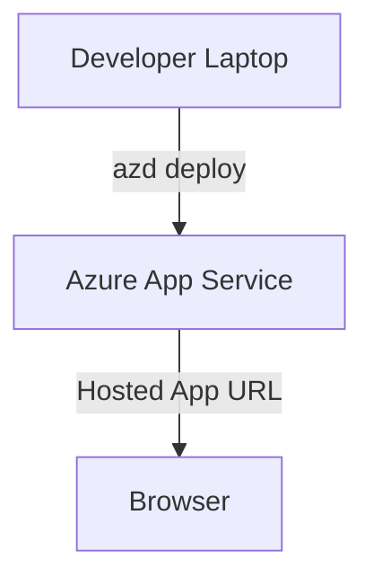

```yaml
---
title: "Deploy a Node.js Express App to Azure App Service in Minutes"
description: "Learn how to quickly create and deploy a minimal Node.js Express app to Azure App Service using the Azure Developer CLI (azd)."
pubDate: "2026-03-24"
heroImage: "/images/blog/deploy-nodejs-to-azure-app-service-hero.png"
tags: ["Azure App Service", "Node.js", "Express.js", "Azure CLI", "Tutorial"]
category: "Tutorial"
author: "Jordan Selig"
---
```

# Deploy a Node.js Express App to Azure App Service in Minutes

Want to deploy a Node.js app to the cloud without breaking a sweat? That’s exactly what I’ll show you how to do today. We’re going to build a simple "Hello World" app using Express.js and deploy it to Azure App Service using the Azure Developer CLI (`azd`). Whether you're testing Azure for the first time or just need a quick win, this tutorial is perfect for you.

Azure App Service is a fully managed platform for hosting web apps, APIs, and backends. It takes care of scaling, patching, and other operational headaches, so you can focus on your code. And with `azd`, deploying to App Service is practically magic—minimal setup, instant results.

Let’s dive in.

---

## Architecture Overview

Here’s the flow we’re working with:



In this tutorial, we’ll set up a basic Node.js app locally, use `azd` to deploy it, and access the hosted app in a browser. Azure App Service will handle the infrastructure, so you can focus on your code.

---

## Prerequisites

Before we start, make sure you’ve got everything you need:

1. **Azure Account**: If you don’t have one, [sign up for free](https://azure.microsoft.com/en-us/free/). Azure App Service’s free tier makes this tutorial cost-effective.
2. **Node.js Installed**: Version 16 or higher is recommended. [Download Node.js here](https://nodejs.org/).
3. **Azure Developer CLI (`azd`) Installed**: Follow the [installation guide](https://learn.microsoft.com/en-us/azure/developer/azure-developer-cli/install-azd).
4. **Git Installed**: You’ll need it for managing the sample repository. [Install Git](https://git-scm.com/).
5. **Basic Knowledge of Node.js and Express.js**: Familiarity with creating and running a simple Node.js app is helpful.

Optional but recommended: Use Visual Studio Code for editing and debugging.

---

## Step 1: Build Your Hello World App

First, let’s create the simplest Express.js app possible. Open your terminal and follow these steps:

### 1.1 Initialize the Project

Run the following commands to set up your project directory:

```bash
mkdir hello-world-nodejs
cd hello-world-nodejs
npm init -y
```

This creates a new project with a default `package.json` file.

### 1.2 Install Express.js

Add Express.js to your project:

```bash
npm install express
```

### 1.3 Create the App File

Inside your project directory, create a file named `app.js`:

```bash
touch app.js
```

Add the following code to `app.js`:

```javascript
const express = require('express');
const app = express();
const port = process.env.PORT || 3000;

app.get('/', (req, res) => {
  res.send('Hello, World!');
});

app.listen(port, () => {
  console.log(`Server is running on port ${port}`);
});
```

This sets up a simple Express server that responds with "Hello, World!" when accessed.

### 1.4 Test Locally

Run the app locally to make sure everything’s working:

```bash
node app.js
```

Open your browser and go to `http://localhost:3000`. You should see "Hello, World!" displayed.

---

## Step 2: Deploy to Azure App Service

Now that your app is ready, let’s deploy it to Azure.

### 2.1 Initialize Azure Deployment

Run the following command to initialize your project for Azure:

```bash
azd init
```

You’ll be prompted to select a template. Choose `node-express`. This sets up the deployment configuration for your Node.js app.

### 2.2 Configure Deployment Settings

Follow the prompts to configure your Azure resources:

- **Environment Name**: Choose a name for your environment (e.g., `dev`).
- **Resource Group**: Specify a unique name or let `azd` create one for you.
- **App Name**: Pick a name for your app.

### 2.3 Deploy the App

Deploy your app using:

```bash
azd up
```

This command provisions the necessary Azure resources and deploys your app. Once it’s done, you’ll see a URL where your app is hosted.

### 2.4 Verify Deployment

Visit the URL provided by `azd` in your browser. You should see "Hello, World!" displayed, just like you did locally.

---

## Step 3: Cost Breakdown

Good news: This deployment is free! Azure App Service’s free tier covers:

- 1 GB of storage.
- 60 minutes of compute time per day.

Since our app is minimal, you won’t exceed these limits during testing.

For more details on pricing, check out [Azure App Service pricing](https://azure.microsoft.com/en-us/pricing/details/app-service/).

---

## Step 4: Cleanup Resources

When you’re done testing, it’s a good idea to clean up the resources to avoid any surprises. Use `azd` to tear everything down:

```bash
azd down
```

This deletes the resource group and all associated resources.

---

## Conclusion

And there you have it—a Node.js app deployed to Azure App Service in just a few steps! We built a simple Express.js app, deployed it using the Azure Developer CLI, and accessed it via a hosted URL. Azure App Service makes hosting web apps ridiculously easy, and `azd` streamlines the entire process.

What’s next? You could:

- Explore scaling options for your app.
- Add custom domains and HTTPS.
- Dive into Azure Functions for serverless workflows.

Check out [this tutorial on integrating Azure Functions](https://learn.microsoft.com/en-us/azure/azure-functions/) or [how to scale your App Service](https://learn.microsoft.com/en-us/azure/app-service/manage-scale).

Got questions or feedback? Drop a comment below—I’d love to hear how your deployment goes!

Happy coding!