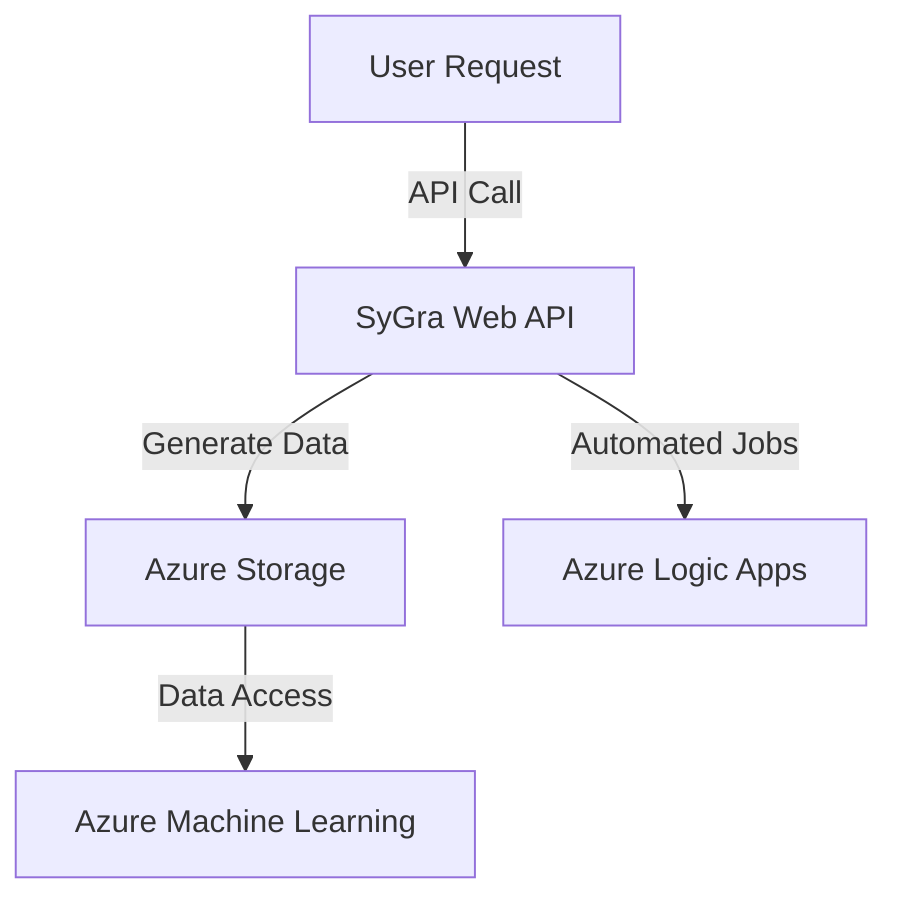

```yaml
---
title: "Automating Synthetic Data Pipelines with Azure App Service and SyGra"
description: "Learn how to deploy and automate synthetic data workflows using SyGra and Azure App Service. This step-by-step tutorial covers integration, scalability, and cost optimization."
pubDate: "2026-03-20"
heroImage: "/images/blog/automating-synthetic-data-azure-hero.png"
tags: ["Azure App Service", "Synthetic Data", "Machine Learning", "SyGra"]
category: "Tutorial"
author: "Jordan Selig"
---
```

# Automating Synthetic Data Pipelines with Azure App Service and SyGra

Synthetic data is a game-changer for machine learning, especially when real-world data is too sensitive, scarce, or expensive to collect. I’ve been experimenting with SyGra—a graph-oriented synthetic data generation tool—and found a killer combo by pairing it with Azure App Service. The result? A scalable, automated pipeline for generating synthetic data tailored to machine learning workflows.

In this tutorial, I’ll show you how to deploy SyGra on Azure App Service, automate its workflows, and integrate it with other Azure tools like Azure Storage. By the end, you’ll have a production-ready synthetic data pipeline and a clear plan for scaling it to meet your needs.

Let’s dive in!

---

## Architecture Overview

Here’s the big picture: We’ll deploy SyGra as a web API on Azure App Service. This setup allows us to automate synthetic data generation workflows, store the data in Azure Storage, and even hook it into Azure Machine Learning for downstream tasks like model training. Below is the architecture diagram to visualize the workflow:



---

## Prerequisites

Before we start, make sure you have the following:

- **Azure Subscription**: A free tier account works for this implementation. [Sign up here](https://azure.microsoft.com/free).
- **Python Installed**: SyGra is Python-based, so you’ll need Python 3.8+ installed locally.
- **Azure CLI**: You’ll use it to deploy resources. [Install it here](https://learn.microsoft.com/en-us/cli/azure/install-azure-cli).
- **SyGra Repository**: Clone the [SyGra GitHub repo](https://github.com/sygra) to your local machine.
- **Basic Azure Knowledge**: Familiarity with App Service, Storage, and Logic Apps is helpful.

---

## Step-by-Step Implementation

### Step 1: Set Up SyGra Locally

Start by setting up SyGra on your local machine to understand its core functionality.

1. **Clone the repository**:
   ```bash
   git clone https://github.com/sygra/sygra.git
   cd sygra
   ```

2. **Install dependencies**:
   ```bash
   pip install -r requirements.txt
   ```

3. **Run SyGra locally**:
   ```bash
   python app.py
   ```
   This starts SyGra’s web API locally. You can test it by sending requests to `http://127.0.0.1:5000`.

4. **Test data generation**:
   Use a tool like Postman or cURL to send a sample API request:
   ```bash
   curl -X POST http://127.0.0.1:5000/generate -d '{"config": "sample-config.json"}'
   ```

---

### Step 2: Prepare Azure App Service

Next, create an Azure App Service instance to host SyGra.

1. **Create a resource group**:
   ```bash
   az group create --name SyGraResourceGroup --location eastus
   ```

2. **Create an App Service plan**:
   ```bash
   az appservice plan create --name SyGraPlan --resource-group SyGraResourceGroup --sku FREE
   ```

3. **Create a web app**:
   ```bash
   az webapp create --name SyGraApp --resource-group SyGraResourceGroup --plan SyGraPlan --runtime "PYTHON:3.8"
   ```

---

### Step 3: Deploy SyGra to Azure App Service

Now, let’s get SyGra running on Azure App Service.

1. **Deploy the code**:
   Use Azure CLI to deploy SyGra’s code to the web app:
   ```bash
   az webapp up --name SyGraApp --resource-group SyGraResourceGroup --runtime "PYTHON:3.8"
   ```

2. **Test the deployment**:
   Visit the web app’s URL (e.g., `https://SyGraApp.azurewebsites.net`) and send an API request to verify it’s working:
   ```bash
   curl -X POST https://SyGraApp.azurewebsites.net/generate -d '{"config": "sample-config.json"}'
   ```

---

### Step 4: Automate Workflows with Azure Logic Apps

Azure Logic Apps let you automate synthetic data generation workflows.

1. **Create a Logic App**:
   ```bash
   az logicapp create --name SyGraAutomation --resource-group SyGraResourceGroup
   ```

2. **Set up automation**:
   - Add a trigger (e.g., schedule the workflow to run daily).
   - Configure an HTTP action to call SyGra’s API.
   - Add a storage action to save generated files to Azure Storage.

---

### Step 5: Store Data in Azure Storage

Azure Storage is perfect for saving and accessing your generated datasets.

1. **Set up a storage account**:
   ```bash
   az storage account create --name SyGraStorage --resource-group SyGraResourceGroup --location eastus --sku Standard_LRS
   ```

2. **Create a container**:
   ```bash
   az storage container create --name synthetic-data --account-name SyGraStorage
   ```

3. **Upload generated data**:
   Use Logic Apps or direct API calls to save files to the `synthetic-data` container.

---

## Cost Estimate

Here’s the breakdown of costs for this setup:

- **Azure App Service**: Free tier is eligible for basic deployment. Premium tiers (~$20/month) support higher workloads.
- **Azure Storage**: Free tier includes generous storage limits; scaled use costs ~$0.10/GB.
- **Logic Apps**: Pay-as-you-go model; minimal cost for light usage.

For scaled production use, plan for ~$20-$50/month depending on workload.

---

## Cleanup Instructions

Don’t forget to clean up resources to avoid unexpected charges.

1. **Delete the resource group**:
   ```bash
   az group delete --name SyGraResourceGroup --yes --no-wait
   ```

2. **Confirm deletion**:
   Double-check the Azure portal to ensure all resources are removed.

---

## Conclusion

We just built a fully automated synthetic data pipeline using Azure App Service and SyGra. This setup is scalable, cost-effective, and perfect for machine learning workflows where real-world data is limited or sensitive. 

Next steps? Consider integrating this pipeline with Azure Machine Learning to train and validate your models. Or explore advanced SyGra features like custom graph configurations for more tailored datasets.

Got questions or ideas to share? Let me know in the comments—I’d love to hear how you’re using synthetic data!

--- 

Want more? Check out [Deploying Python Apps on Azure](https://learn.microsoft.com/en-us/azure/app-service/quickstart-python) for tips on Azure App Service. See you in the next tutorial!