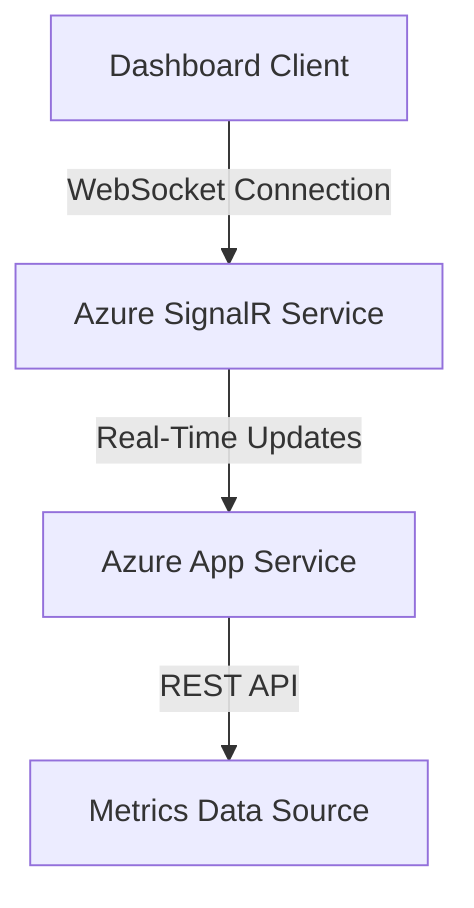

```yaml
---
title: "Build a Real-Time Metrics Dashboard with Azure App Service and SignalR"
description: "Learn how to create a live metrics dashboard using Azure App Service and SignalR for real-time updates. Step-by-step tutorial with code examples."
pubDate: "2026-03-22"
heroImage: "/images/blog/real-time-dashboard-hero.png"
tags: ["Azure App Service", "SignalR", "real-time updates", "dashboard"]
category: "Tutorial"
author: "Jordan Selig"
---
```

# Build a Real-Time Metrics Dashboard with Azure App Service and SignalR

Real-time dashboards are everywhere—whether it’s tracking user activity, monitoring server health, or visualizing live event data, they’ve become critical for applications with dynamic data. I’ve built my fair share of dashboards, and one combo I keep coming back to is Azure App Service paired with SignalR. Why? Because it makes real-time updates almost effortless, and it scales like a dream.

In this tutorial, I’m taking you step-by-step through building your own real-time metrics dashboard using these tools. By the end of this, you’ll have a fully working dashboard deployed on Azure, complete with live updates powered by SignalR.

## Architecture Overview

Here’s the big picture of what we’re building:



- **Client**: A web-based dashboard built with HTML and JavaScript, receiving real-time updates via SignalR.  
- **App Service**: Hosts the backend logic and SignalR hub, connecting the data source to SignalR.  
- **SignalR Service**: Manages real-time communication between the server and connected clients.  
- **Data Source**: Simulated metrics data for this tutorial (but you can plug in live data later).

## Prerequisites

Before diving in, make sure you have the following:

1. **Azure subscription**: It’s free to sign up, and this tutorial is free-tier eligible.  
2. **Development tools**:
   - Visual Studio Code (or your preferred IDE).
   - .NET SDK installed (minimum version: .NET 6).  
   - Azure CLI installed for resource management.  
3. **Basic knowledge**: Familiarity with web development (HTML, JavaScript, and ASP.NET Core) and Azure services.  

Ready? Let’s build this thing.

## Step-by-Step Implementation

### Step 1: Set Up Azure Resources

First, we need an Azure App Service and a SignalR Service instance. Fire up your terminal and follow these steps:

```bash
# Log in to Azure
az login

# Create a resource group
az group create --name RealTimeDashboardRG --location eastus

# Create App Service plan (free tier)
az appservice plan create --name DashboardAppPlan --resource-group RealTimeDashboardRG --sku F1

# Create App Service
az webapp create --name RealTimeDashboardApp --plan DashboardAppPlan --resource-group RealTimeDashboardRG

# Create SignalR Service (free tier)
az signalr create --name DashboardSignalR --resource-group RealTimeDashboardRG --sku Free
```

Done? Great. Now let’s write some code.

---

### Step 2: Build the Server-Side App

The backend will be an ASP.NET Core app that hosts a SignalR hub for broadcasting updates. Create a new project:

```bash
dotnet new webapp -o RealTimeDashboard
cd RealTimeDashboard
```

Add the SignalR package:

```bash
dotnet add package Microsoft.AspNetCore.SignalR
```

Update `Startup.cs` to include SignalR:

```csharp
using Microsoft.AspNetCore.SignalR;

var builder = WebApplication.CreateBuilder(args);
var app = builder.Build();

app.MapHub<MetricsHub>("/metricsHub"); // SignalR route

app.Run();

public class MetricsHub : Hub
{
    public async Task SendMetrics(string message)
    {
        await Clients.All.SendAsync("ReceiveMetrics", message);
    }
}
```

This sets up a SignalR hub at `/metricsHub`. Clients will connect here for real-time updates.

---

### Step 3: Develop the Frontend Dashboard

Create a simple HTML file to act as your dashboard. Place this in the `wwwroot` folder:

**File: wwwroot/index.html**

```html
<!DOCTYPE html>
<html lang="en">
<head>
  <meta charset="UTF-8">
  <meta name="viewport" content="width=device-width, initial-scale=1.0">
  <title>Real-Time Metrics Dashboard</title>
  <script src="https://cdnjs.cloudflare.com/ajax/libs/microsoft-signalr/6.0.0/signalr.min.js"></script>
</head>
<body>
  <h1>Metrics Dashboard</h1>
  <div id="metrics"></div>
  <script>
    const connection = new signalR.HubConnectionBuilder()
      .withUrl("/metricsHub")
      .build();

    connection.on("ReceiveMetrics", (data) => {
      document.getElementById("metrics").innerText = `Live Metrics: ${data}`;
    });

    connection.start().catch(err => console.error(err));
  </script>
</body>
</html>
```

This connects to the SignalR hub and listens for updates. When data arrives, it updates the page.

---

### Step 4: Deploy to Azure App Service

Deploy the app using the Azure CLI:

```bash
# Publish the app
dotnet publish -o ./publish

# Deploy to App Service
az webapp deploy --name RealTimeDashboardApp --resource-group RealTimeDashboardRG --src-path ./publish
```

Once deployed, open your app in the browser. You’ll see your real-time dashboard ready to roll.

---

### Step 5: Simulate Metrics Updates

Test the real-time functionality by sending updates from the server. Add this code to `MetricsHub`:

```csharp
public async Task BroadcastMetrics()
{
    while (true)
    {
        var metrics = $"Server Load: {new Random().Next(1, 100)}%";
        await Clients.All.SendAsync("ReceiveMetrics", metrics);
        await Task.Delay(1000); // Update every second
    }
}
```

Call `BroadcastMetrics()` when the app starts to simulate live updates.

---

## Cost Estimate

This setup is eligible for Azure’s free tier, so you won’t pay a dime during testing. For production use:

- **App Service (Basic Plan)**: ~$13/month.  
- **SignalR Service (Standard Tier)**: ~$7/month.  

Total: Around $20/month for small-scale production.

---

## Cleanup

When you’re done testing, clean up your Azure resources to avoid charges:

```bash
az group delete --name RealTimeDashboardRG --yes --no-wait
```

Double-check the Azure portal to ensure everything’s gone.

---

## Conclusion

And that’s it! You’ve built a real-time metrics dashboard using Azure App Service and SignalR. This setup works for anything from monitoring systems to live user events. The best part? It’s scalable and easy to extend—add authentication, plug into real data sources, or even deploy globally.

If you want to dive deeper, check out [Azure SignalR Service Documentation](https://learn.microsoft.com/en-us/azure/azure-signalr/) or explore [App Service tutorials](https://learn.microsoft.com/en-us/azure/app-service/). Happy coding!